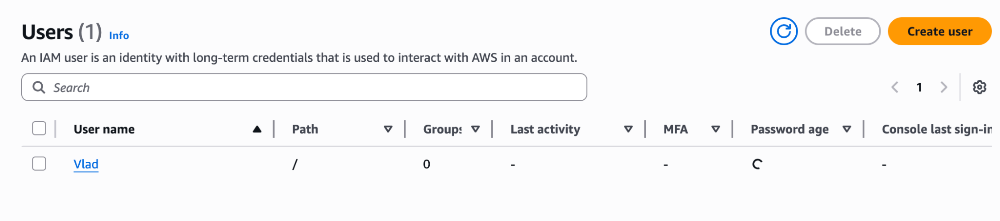

# Лабораторна робота 1 

1) Реєструємося в AWS.
2) Створюємо User і даємо йому всі дозволи

Процес створення юзера
    

Новостворений юзер

      

3) Створюємо ще одного користувача і політику для нього.

Процес створення політики
    

Процес створення ролі

      
4) Створимо VPC.

Створення VPC

5) Обчислимо бюджет:
2 EC2 = 2 * 8$ = 16$;
EBS * 2 = 0.8$ * 2 = 1.6$
  
Враховуючи використання недорогого тарифу - приблизно 18$
    
# Контрольні питання

1) IaaS надає інфраструктуру як послугу (віртуальні машини, сховища) - використовують коли потрібен повний контроль. PaaS дає готову платформу для розгортання застосунків. SaaS це готові програми.
2) Регіон це географічна зона, AZ  це окремий датацентр усередині неї - вибирають ближче до користувача.
3) IaC означає керування інфраструктурою через код.
4) Ролі дають тимчасовий доступ, групи користувачів - постійний. Ролі зручні для сервісів або для спільного використання між акаунтами.
5) VPC це віртуальна мережа, CIDR визначає діапазон IP, наприклад 10.0.0.0/16 - можна ділити на підмережі.
6) Публічна підмережа має маршрут до IGW і вихід в інтернет, приватна - тільки внутрішній доступ.
7) Allow дозволяє дії, Deny блокує.

# Висновки
У ході виконання лабораторної роботи було налаштовано базу для подальшого виконання робіт з курсу.

